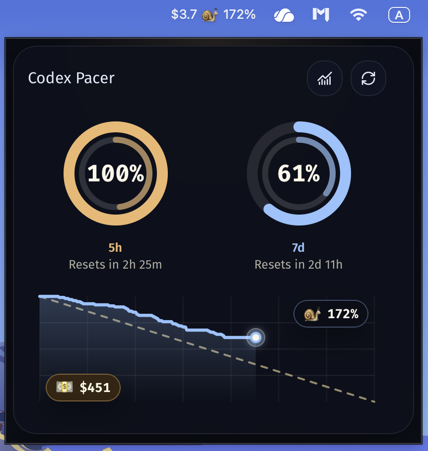

# Codex Pacer

English | [简体中文](./README.zh-CN.md)

<p align="center">
  
</p>

**Codex Pacer** is a local-first desktop app for understanding Codex usage as pace, value, and session-level activity. It helps you see how quickly you are consuming quota, what that usage is worth in API-equivalent terms, and which conversations or subagents are driving it.

> Current stable release: **v1.1.2**
> Official download: signed **macOS Apple Silicon DMG** via GitHub Releases. Windows installer publishing is paused for this release.

## Highlights

- Imports local Codex usage data from `~/.codex` or a custom `CODEX_HOME`
- Builds a local SQLite index for fast analysis and drill-down views
- Estimates API-equivalent value and subscription payoff from token usage
- Recognizes GPT-5.6 Sol, Terra, and Luna with bundled Standard API pricing
- Tracks rolling quota windows, including `5-hour` and `7-day` pacing when available
- Breaks usage down by conversation, root session, subagent, model, and token composition
- Provides a macOS menu bar experience for quick quota checks

## Why people use it

Codex Pacer is built for practical questions:

- Am I on pace to use this window well before reset?
- How much value have I already extracted from my subscription?
- Which sessions, models, or subagents are consuming the most?
- How does my remaining quota compare with the time left in the window?

## Privacy

Codex Pacer is local-first:

- it reads local Codex session and rate-limit data
- it stores derived analysis in a local SQLite database
- it does not require a cloud account or sync service to work

## Getting started

The documentation set for installation, packaging, and release notes is maintained for the public `v1.1.2` release. Start with:

- [Getting started](./docs/en/getting-started.md)
- [Installing on macOS](./docs/en/installing-on-macos.md)
- [Installing on Windows](./docs/en/installing-on-windows.md)
- [Packaging and release](./docs/en/packaging-and-release.md)
- [Release notes for v1.1.2](./docs/en/release-notes-v1.1.2.md)

On macOS, Codex Pacer can use the Codex CLI bundled with the ChatGPT desktop app for live quota reads. It discovers `/Applications/ChatGPT.app/Contents/Resources/codex` automatically. A standalone Codex CLI and the `CODEX_BIN` override remain supported.

## Development

Requirements:

- Node.js 22.18+
- Rust toolchain
- Tauri build prerequisites for your platform
- Local Codex data under `~/.codex` or a custom `CODEX_HOME`

Common commands:

```bash
npm install
npm run tauri dev
```

Browser preview:

```bash
npm run dev
```

Production build:

```bash
npm install
npm run build
cargo test --manifest-path src-tauri/Cargo.toml --locked
npm run tauri build
```

## Project status

`v1.1.2` is the current stable release line.

Current release packaging focus:

- officially released: signed macOS Apple Silicon DMG
- paused for this release: Windows NSIS setup EXE
- source build support: additional Tauri-compatible desktop environments

## Open source

- [Changelog](./CHANGELOG.md)
- [Contributing](./CONTRIBUTING.md)
- [Security policy](./SECURITY.md)
- [Code of conduct](./CODE_OF_CONDUCT.md)
- [License](./LICENSE)
