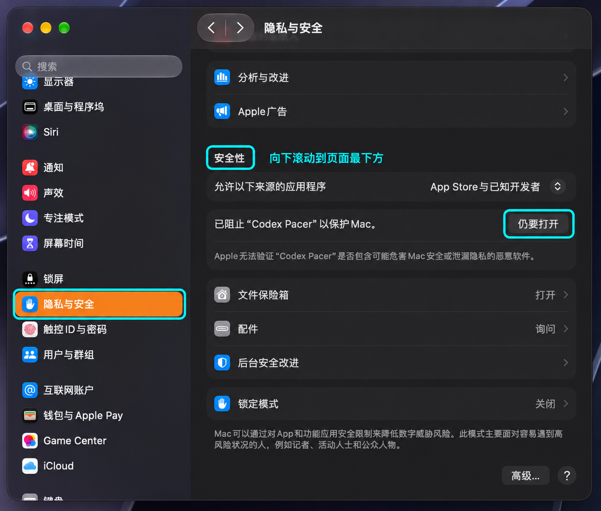

# Codex Pacer 2.1

[简体中文](README.zh-CN.md) · [Download the latest release](https://github.com/RyanZhangNTU/codex-pacer/releases/latest)

A native macOS island for Codex tasks, output rate and account quota. Hover to expand, move away to collapse, or pin it open.


- See local and enabled SSH tasks, their current stage, and ended turns; click a task to open its conversation.
- See the aggregate output-rate estimate for running tasks, with tool waits handled separately from generation.
- Track short and seven-day quota, reset countdowns, pacing and the current cycle. Banked resets expiring within the current cycle appear on the curve.
- View account Credit balance and available reset credits; click the reset count to see exact expiry times, or select an expiry marker on the curve.
- Keep ended-turn cards until clicked, their state changes, or the configured retention expires; receive a reminder while the island is collapsed.
- Adjust appearance, display, reminders and privacy. Menu-bar visibility is optional. Quit from the island or settings.
- Choose Automatic, Notch or Floating on any display; browse tasks three at a time while quota stays visible.
- Use adaptive width by default, or adjust a single width with a preview and slider in Settings.
- View per-request TPS and observed first-output latency for each task; choose Energy Saving, Balanced or More Responsive display updates.
- Use English or Simplified Chinese, following your Mac's language by default or selecting a language in Settings.
- Update inside the app: daily checks by default, with download and installation after you choose to install.

**Requirements:** macOS 14 or later, Apple Silicon or Intel. Liquid Glass requires macOS 26 or later. An authenticated Codex installation and Python 3 provide account/task data; remote sources require existing non-interactive OpenSSH access.

## Install the unsigned release

The unsigned release may be blocked by macOS before the DMG opens. For a manual replacement, quit the old version first. If your installed version has **Check for Updates**, use it to download, verify, install and relaunch automatically.

1. [Download the DMG from the latest release](https://github.com/RyanZhangNTU/codex-pacer/releases/latest) and **double-click it first**. Dismiss the macOS blocking alert.
2. Go to **System Settings → Privacy & Security**, **scroll to Security at the bottom**, find the blocked installer, and choose **Open / Open Anyway**. Confirm when prompted.
3. **Double-click the DMG again**, drag **Codex Pacer** into **Applications**, then launch it from Applications.

If macOS also blocks the app, repeat step 2 for Codex Pacer, then launch it again.



[First-launch help from Apple](https://support.apple.com/102445) · [Chinese user guide](docs/usage.zh-CN.md)

## Development

Requires Xcode 26 or newer. The app has no npm or Rust dependencies.

```sh
make test TEST_FILTER='CompletionInboxTests|SessionNameTests' # during development
make build # when an app is needed for UI checks
```

Run the full suite once for a release candidate. Builds run in local temporary directories, reuse pinned dependency caches and print the app path. Use `make release-unsigned` for the unsigned universal DMG, or `make release` for the separate Developer ID signing/notarization workflow; no separate preview build is needed just for publication. See [development and data semantics](docs/development.md) and [releasing](docs/releasing.md).

The maintained codebase contains only native macOS code. React/Tauri and Windows 1.x remain available in [Git history and previous releases](https://github.com/RyanZhangNTU/codex-pacer/releases).

[Contributing](CONTRIBUTING.md) · [Security](SECURITY.md) · [MIT License](LICENSE)
