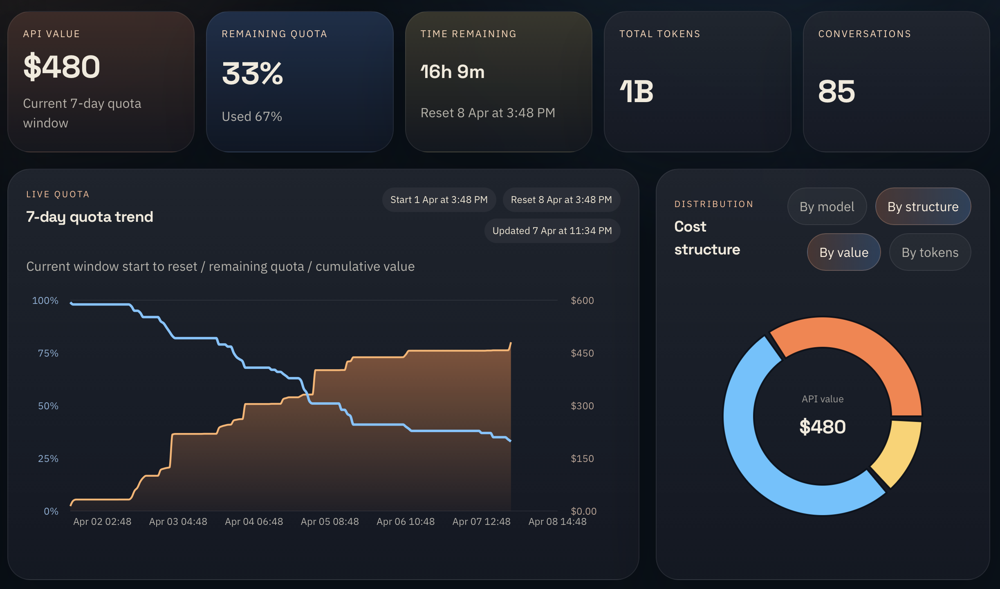
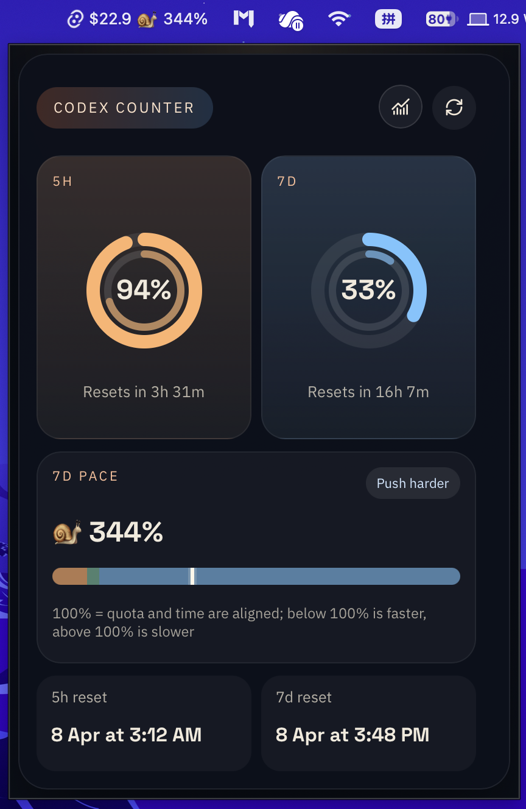

# Codex Pacer

[English](./README.md) | 简体中文

**Codex Pacer** 是一个本地优先的桌面应用，用来把 Codex 使用情况转换成更容易行动的视角：额度节奏、API 等价价值，以及会话级别的使用分析。你可以更快看清自己消耗额度的速度、订阅回报，以及哪些对话或 subagent 正在驱动这些使用量。

> 当前稳定版本：**v1.0.0**  
> 官方下载：通过 GitHub Releases 获取已签名并完成 notarization 的 **macOS Apple Silicon DMG**




## 核心能力

- 从 `~/.codex` 或自定义 `CODEX_HOME` 导入本地 Codex 使用数据
- 建立本地 SQLite 索引，便于快速分析和下钻
- 基于 token 使用量估算 API 等价价值与订阅回本情况
- 在可用时跟踪 `5小时`、`7天` 等滚动额度窗口的使用节奏
- 按对话、root session、subagent、模型、token 构成拆解使用情况
- 提供 macOS 菜单栏入口，方便快速查看额度状态

## 为什么要用它

Codex Pacer 关注的是更实际的问题：

- 我现在的使用速度是否合理，能不能在 reset 前把窗口用好？
- 这份订阅目前已经换回了多少 API 等价价值？
- 哪些会话、模型或 subagent 消耗最多？
- 剩余额度和剩余时间是否匹配？

## 隐私

Codex Pacer 是本地优先的：

- 读取的是本地 Codex 会话与 rate-limit 数据
- 分析结果保存在本地 SQLite 数据库中
- 不依赖云端账号或同步服务即可工作

## 开始使用

安装、打包和发布说明正在为公开 `v1.0.0` 版本整理中。可以先从这些文档入口开始：

- [快速开始](./docs/zh-CN/getting-started.md)
- [在 macOS 上安装](./docs/zh-CN/installing-on-macos.md)
- [打包与发布](./docs/zh-CN/packaging-and-release.md)
- [v1.0.0 发布说明](./docs/zh-CN/release-notes-v1.0.0.md)

## 开发

环境要求：

- Node.js 20+
- Rust toolchain
- 当前平台所需的 Tauri 构建依赖
- `~/.codex` 或自定义 `CODEX_HOME` 中的本地 Codex 数据

常用命令：

```bash
npm install
npm run tauri dev
```

浏览器预览：

```bash
npm run dev
```

生产构建：

```bash
npm install
npm run build
cargo test
npm run tauri build
```

## 项目状态

`v1.0.0` 是当前稳定发布线。

当前发布重点：

- 官方发布：已签名并完成 notarization 的 macOS Apple Silicon DMG
- 源码构建：其他兼容 Tauri 的桌面环境

## 开源协作

- [更新日志](./CHANGELOG.md)
- [参与贡献](./CONTRIBUTING.md)
- [安全策略](./SECURITY.md)
- [行为准则](./CODE_OF_CONDUCT.md)
- [许可证](./LICENSE)
